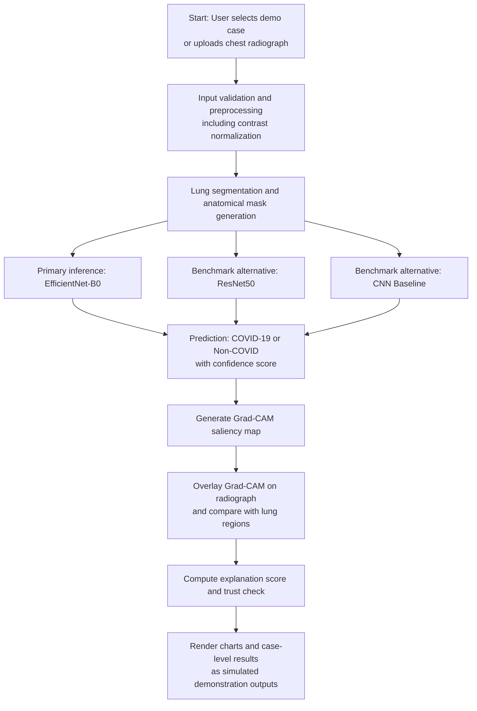
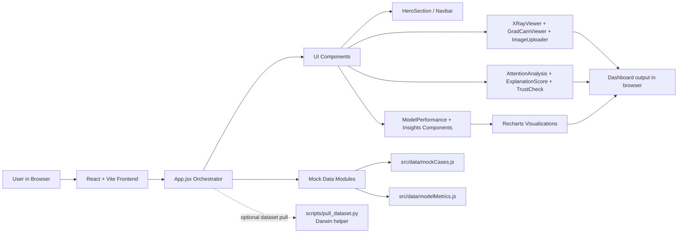

# Explainable Deep Learning for COVID-19 Detection Using Chest Radiographs

> **Healthcare Analytics Project**  
> *Symbiosis Institute of Technology (SIT), Symbiosis International (Deemed University)*  
> **Academic Demonstration & Research Prototype Dashboard**


[](https://vitejs.dev/)
[](https://arxiv.org/abs/1610.02391)
[](https://darwin.v7labs.com)
[](https://github.com/sharvayuzade/Explainable-Deep-Learning-for-COVID-19-Detection-Using-Chest-Radiographs-)

---

## 📌 Project Overview

This repository contains the interactive research frontend for **Explainable Deep Learning for COVID-19 Detection Using Chest Radiographs**. The system evaluates deep convolutional neural networks (EfficientNet-B0, ResNet-50, and CNN Baseline) while leveraging **Gradient-weighted Class Activation Mapping (Grad-CAM)** to visually substantiate model decisions.

The platform provides clinicians, researchers, and students with an interpretable interface to audit neural network predictions against anatomical lung contours.

> ⚠️ **ACADEMIC DEMONSTRATION NOTICE**:  
> Every metric, prediction, chart, and visualization currently displayed is **simulated demonstration data (`DEMO DATA`)** for educational evaluation. It is not a clinical medical diagnostic system and must not be used for patient decision-making.

---

## 🔄 System Pipeline & Workflow

### End-to-End Explainable Inference Flow



### Application & Data/Component Pipeline



**Legend / Notes**
- **Input stage**: uses either curated demo cases or uploaded chest radiographs.
- **Model stage**: EfficientNet-B0 is the primary demonstration model; ResNet50 and CNN Baseline are benchmark comparators.
- **Explainability stage**: Grad-CAM overlays are compared against segmented lung regions to support interpretability analysis.
- **Output stage**: predictions, confidence, trust indicators, and charts are presented as **simulated demonstration data (`DEMO DATA`)**.
- This repository remains an **academic demonstration**, not a clinical diagnostic system.

---

## ✨ Key Features

### 1. Interactive X-Ray Analysis Workbench
- **Multi-Case Auditing**: Switch between curated demonstration cases illustrating both true predictions and failure modes:
  - **Case 01**: *Correct COVID-19* (Bilateral lower-lobe opacity detection)
  - **Case 02**: *Correct Non-COVID* (Normal baseline pulmonary parenchymal aeration)
  - **Case 03**: *Demo False Positive* (Shortcut learning / clavicular density artifact)
  - **Case 04**: *Demo False Negative* (Subtle retrocardiac consolidation with low saliency)

### 2. Tri-Panel Grad-CAM XAI Visualizer
- **Synchronized Tri-Panel Display**:
  - **Panel 1 — Original**: Raw digital chest radiograph.
  - **Panel 2 — Grad-CAM**: Spatial gradient-weighted activation heatmap.
  - **Panel 3 — Overlay**: Alpha-blended radiograph + heatmap fusion.
- **Dynamic Colormap Engine**: Switch between **Jet / Thermal**, **Viridis**, and **Inferno** palettes with scaled gradient energy legends ($0.00 \to 1.00$).

### 3. External Radiograph Upload Module
- **Drag & Drop Upload**: Upload user-supplied chest radiographs (DICOM-exported PNG, JPEG, or WebP).
- **One-Click Clinical Sample**: Pre-configured sample CXR generator for instant evaluation.
- **Simulated Inference Pipeline**: Real-time laser scanning animation with step-by-step processing indicators (*Contrast normalization* $\to$ *Lung segmentation* $\to$ *EfficientNet-B0 forward pass* $\to$ *Grad-CAM synthesis*).

### 4. Advanced Clinical Radiographic Controls
- **Radiographic LUT Filters**:
  - **Grayscale**: Standard clinical radiograph view.
  - **Bone Invert**: Inverted density view for skeletal and calcification contrast.
  - **High Contrast**: Enhanced lung field soft-tissue window.
- **Heatmap Opacity Slider**: Smooth $0\% \to 100\%$ alpha-blending slider to fade between raw anatomy and neural attention maps.

### 5. Signature AI Explanation & Trust Check
- **AI Explanation Score**: Dynamic circular radial gauge calculating the intersection-over-union (IoU) overlap between model attention centroids and segmented pulmonary masks.
- **AI Trust Check**: Multi-factor research indicator combining prediction confidence, lung alignment score, verification status, and explanation quality.

### 6. Architecture Benchmarks & Healthcare Insights
- **Model Comparison**: EfficientNet-B0 (*Demo Best Model*), ResNet50, and CNN Baseline.
- **Interactive Recharts ROC Curve**: True Positive Rate vs False Positive Rate curves with AUC comparison.
- **Simulated Confusion Matrix**: $2 \times 2$ matrix ($N = 500$) with sensitivity and specificity metrics.
- **Healthcare Analytics Considerations**: Educational cards discussing clinical sensitivity stakes, explainability in triage, and safety governance.

---

## 🛠️ Technology Stack

- **Framework**: React 19 + Vite 8
- **Styling**: Tailwind CSS (Medical Light Research Theme)
- **Icons**: Lucide React
- **Data Visualization**: Recharts
- **Dataset CLI**: Darwin-py (V7 Labs)

---

## 📂 Repository Structure

```
├── public/
├── scripts/
│   └── pull_dataset.py       # Helper script to download V7 Darwin dataset
├── src/
│   ├── components/
│   │   ├── Navbar.jsx              # Frosted header with DEMO badge & upload button
│   │   ├── HeroSection.jsx         # Research hero with quick action CTAs
│   │   ├── KpiCards.jsx            # 4 KPI cards (Accuracy, Sensitivity, F1, ROC-AUC)
│   │   ├── ExplanationScore.jsx    # Signature circular gauge (87% alignment)
│   │   ├── TrustCheck.jsx          # Signature multi-factor audit check
│   │   ├── XRayViewer.jsx          # Main analysis card, LUT controls & opacity slider
│   │   ├── GradCamViewer.jsx       # Tri-panel Grad-CAM visualizer & colormaps
│   │   ├── RadiographVisualizer.jsx# SVG & Canvas radiograph and heatmap renderer
│   │   ├── DynamicGradCamCanvas.jsx# Dynamic HTML5 2D canvas generator
│   │   ├── ImageUploader.jsx       # External image dropzone & scanning pipeline
│   │   ├── AttentionAnalysis.jsx   # Lung vs non-lung energy comparison bar
│   │   ├── PredictionExplorer.jsx  # Interactive case cards
│   │   ├── ModelPerformance.jsx    # Benchmark table, ROC curve & confusion matrix
│   │   ├── ModelInsights.jsx       # Research takeaway cards
│   │   ├── HealthcareInsights.jsx  # Clinical considerations
│   │   └── Footer.jsx              # Non-clinical regulatory disclaimer
│   ├── data/
│   │   ├── mockCases.js            # Demonstration cases and radiograph profiles
│   │   └── modelMetrics.js         # Benchmark metrics & ROC curve points
│   ├── App.jsx                     # Core application orchestrator
│   ├── index.css                   # Base styles & animations
│   └── main.jsx                    # Application entry point
├── index.html
├── package.json
├── tailwind.config.js
└── vite.config.js
```

---

## 🚀 Getting Started

### Prerequisites
- Node.js (v18+ recommended)
- Python 3.8+ (optional, for dataset pulling)

### Installation & Running Locally

1. **Clone the repository:**
   ```bash
   git clone https://github.com/sharvayuzade/Explainable-Deep-Learning-for-COVID-19-Detection-Using-Chest-Radiographs-.git
   cd Explainable-Deep-Learning-for-COVID-19-Detection-Using-Chest-Radiographs-
   ```

2. **Install frontend dependencies:**
   ```bash
   npm install
   ```

3. **Start the local development server:**
   ```bash
   npm run dev
   ```
   Open your browser at `http://localhost:5173/`.

4. **Build for production:**
   ```bash
   npm run build
   ```

---

## 🔬 Dataset Access (Optional Darwin Integration)

To download the full 6,500 chest X-ray images from V7 Labs Darwin:

1. Install `darwin-py`:
   ```bash
   pip install darwin-py
   ```

2. Authenticate with your free V7 Darwin account API key:
   ```bash
   darwin authenticate
   ```

3. Pull the dataset release:
   ```bash
   darwin dataset pull v7-labs/covid-19-chest-x-ray-dataset:all-images
   ```
   *(Or run the helper script: `python scripts/pull_dataset.py`)*

---

## ⚖️ Academic Disclaimer

This project was developed for the **Healthcare Analytics** course at Symbiosis Institute of Technology. All outputs, inferences, and saliency heatmaps are intended purely for academic and interpretability research demonstrations and do not represent verified medical diagnostics.
